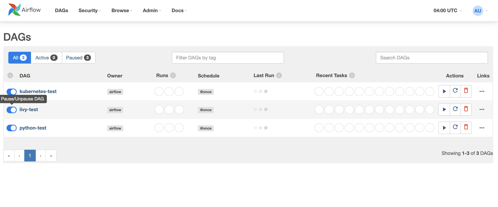

# medical-pipeline

Data pipeline for processing medical text records. Dummy architecture to create a text medical records pipeline with Airflow, CTakes, Spark and Livy in a EKS cluster. 

Airflow is a tool for create ETL pipelines, it provides a web interface to handle DAGs, which are a collection of tasks. Each task can be implemented as you want.    

In order to process text CTakes is used. A custom Docker container that runs as a Kubernetes pod is in charge of processing XML files with CTakes extracting relevant information and codes that refers to medical terms.  You can find more information about CTakes and the custom image used to start the container at this [repo](https://github.com/rootstrap/ctakes)

When we want to process huge amount of information in parallel, we can use Spark. Apache Livy is a REST interface to execute tasks in a Spark Cluster. The Spark Cluster runs in Kubernetes.  

## Architecture 

[architecture](images/architecture.jpg)

- Airflow and Spark can share the same Kubernetes cluster, each component runs as an independent pod. 
- Airflow connects to the Spark Cluster through Apache Livy using the LivyOperator. 
- CTakes runs as a pod container in Kubernetes using the KubernetesPodOperator.

1. Download the [rootstrap/eks-airflow](https://github.com/rootstrap/eks-airflow) repository: 

```bash 
	git clone https://github.com/rootstrap/eks-airflow.git
```
Following the instructions to install Airflow in EKS with EFS CSI driver. 

2. Replace  eks-airflow/blob/main/airflow/chart/values.yaml with [values.yaml](values.yaml)

The following changes has been added to the file:

*Custom Image repository and version*    

```yaml 
	airflowHome: /opt/airflow

	defaultAirflowRepository: rootstrap/eks-airflow

	# Default airflow tag to deploy
	defaultAirflowTag: "2.1.2"

	# Airflow version (Used to make some decisions based on Airflow Version being deployed)
	airflowVersion: "2.1.2"
```

*Git Repository* 

```yaml
dags:
 gitSync:
    enabled: true
    repo: https://github.com/rootstrap/medical-pipeline.git
    branch: k8
    rev: HEAD
    depth: 1
    maxFailures: 5
    subPath: "dags"
```


3. Upgrade the helm chart
```bash 
	helm upgrade airflow -n airflow .            
```

If you have problems when upgrading the chart you can uninstall and install again: 
```bash 
	helm uninstall airflow -n airflow 
	help install  airflow -n airflow .         
```

4. Install Apache Livy in the cluster with this repository [rootstrap/livy-base](https://github.com/rootstrap/livy-base)

5. Configure Livy Connection

Go to Admin->Connections and add a Connection with the following parameters

- Conn Id: livy_conn_id
- Conn Type: Apache Livy
- Description: Apache Livy REST API
- Host: get the ClusterIP for apache-livy executing: 
	```bash
		kubectl get services | grep apache-livy | awk '{print $3}'
	```
- Port: 8998

6. Set Variable CTAKES_KEY 
- Create a CTAKES key at: https://uts.nlm.nih.gov/license.html 
- Go to the Airflow website at Admin -> Variables and add a new Variable with key CTAKES_KEY and the value the one created at UMLS website 

7. Create directories 

```bash 
	kubectl -f permissions.yaml 
```

Create directories:   

```bash 
	export WORKER=$(kubectl get pods  --field-selector=status.phase=Running | grep worker |  awk '{print $1}')
kubectl exec -ti $WORKER -c worker -- mkdir -p /data/input /data/output /data/results
```

Delete auxiliar pod:   

```bash 
	kubectl delete pod efs-bootstrap     
```

Give permissions to result folder: 

```bash 
kubectl apply -f permission_results.yaml 
```

Delete auxiliar pod:   

```bash 
	kubectl delete pod efs-bootstrap     
```

8. Copy files to input dir: 
```bash 
kubectl cp files/* $WORKER:/data/input/
```

9. Create spark custom image 
- Copy custom files

```bash 
wget https://downloads.apache.org/spark/spark-3.1.2/spark-3.1.2-bin-hadoop3.2.tgz 
untar spark-3.1.2-bin-hadoop3.2.tgz 
cp docker/spark/Dockerfile spark-3.1.2-bin-hadoop3.2/kubernetes/dockerfiles/spark/bindings/python/Dockerfile
cp docker/spark/uml-concepts.py spark-3.1.2-bin-hadoop3.2/ 
```

- Download dependency and add it to jars folder 
```bash
	cd spark-3.1.2-bin-hadoop3.2/ 
	wget https://repo1.maven.org/maven2/com/databricks/spark-xml_2.12/0.12.0/spark-xml_2.12-0.12.0.jar .
	mv spark-xml_2.12-0.12.0.jar jars/
```

- export environment variables: REPO, TAG
```bash
	export REPO=rootstrap
	export TAG=uml-concepts1.8
```

- Build image 
```bash
    ./bin/docker-image-tool.sh -r $REPO -t $TAG -p ./kubernetes/dockerfiles/spark/bindings/python/Dockerfile build
```

- Push image
```bash 
	docker push $REPO/spark-py:$TAG
```


## Starting DAGs 

Forward web port: 
```bash 
export POD_NAME=$(kubectl get pods --field-selector=status.phase=Running -o go-template --template '{{range .items}}{{.metadata.name}}{{"\n"}}{{end}}' | grep 'web')
  kubectl port-forward --namespace airflow $POD_NAME 8080:8080

```   

Enter at [http://localhost:8080](http://localhost:8080)



## Using a custom Docker image for Airflow 

In this case, we used the [Dockerfile](docker/airflow/Dockerfile) the REPO=rootstrap/eks-airflow and the TAG=2.1.2.
You can modify it to create your own image. Before step 2, you need to push it and then change in the values.yaml file for the corresponding repository and image tag.

```bash 

	cd docker/airflow 

	export TAG=... 
	export REPO=...

	docker build -t $REPO:$TAG .

	docker push $REPO:$TAG 
```
